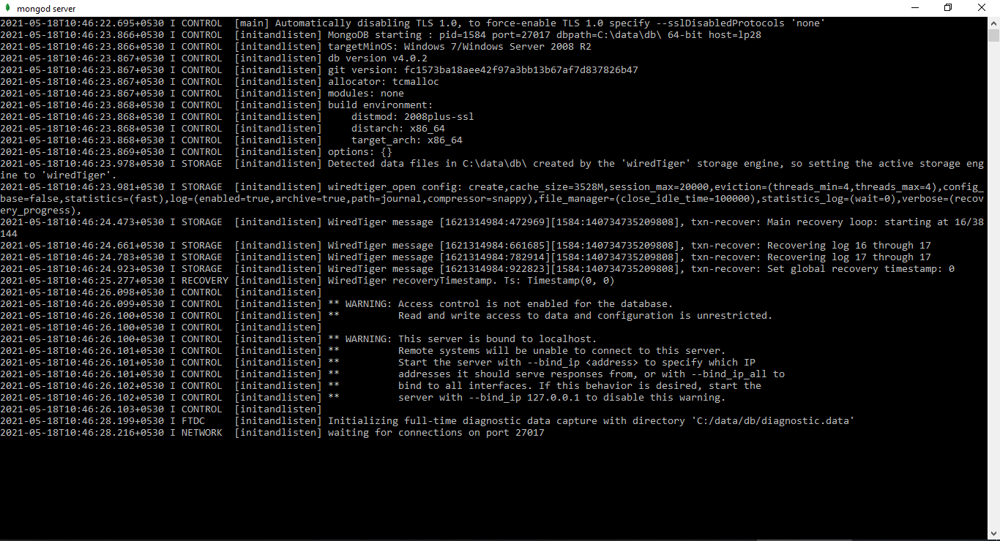

## Getting Started

These instructions will get you a copy of the project up and running on your local machine for development and testing purposes. See deployment for notes on how to deploy the project on a live system.

	<ul>
		<li><a href="#prerequisites">Prerequisites</a></li>
	</ul>

### Prerequisites

*	You need to have **MongoDB** installed on your machine to run the application. To start the MongoDB server, on your windows machine navigate to **`C:\Program Files\MongoDB\Server\4.0\bin\`** folder and double-click on **`mongod.exe`** file

	
*	[dotenv-java](https://github.com/cdimascio/dotenv-java) is used to Load environment variables from the **.env** file.
